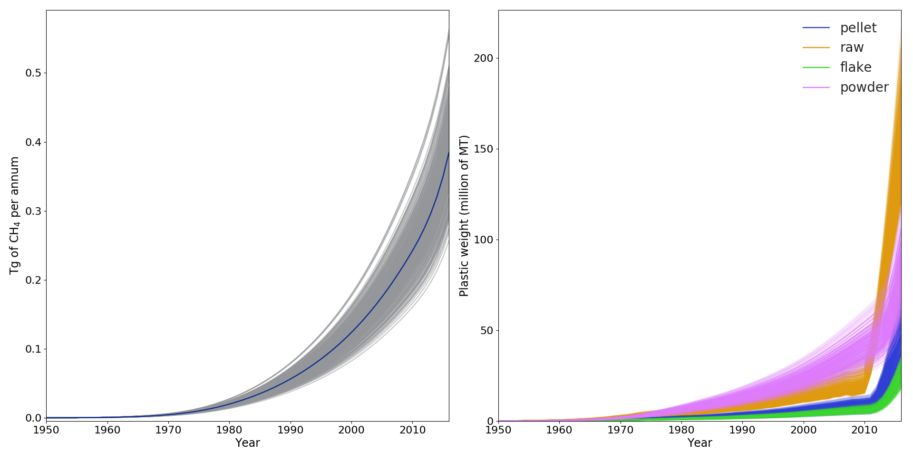
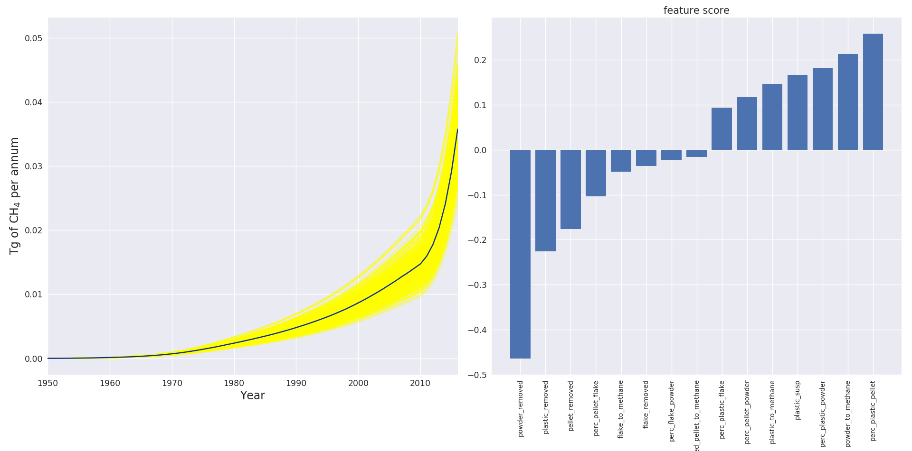

# Monte-Carlo Simulation of Methane production through marine plastic degradation


Plastic marine debrits represent a major threat for marine biological systems, and.... In addition, marine plastic debrits in suspension are and will be in the future a significant source of methane production throuh solar photo-degradation. This package is a simulation of the methane production through marine plastic photodegradation. The methane production of a plastic particule in suspension is related to its exposure to UV radiation, the size and surface of the particule, the exposure time, and the plastic type. The model uses estimations of these different parametetd as input in combination with the estimations of plastic dumped into the ocean since the 50s.

## Requirements
* Python 3.x
* scikit-learn, numpy / scipy / seaborn

## Installation

```bash
git clone https://github.com/opoirion/MethaneBudgetModel
pip3 install --user -r requirements.txt -e .
```

## Usage
```python
python MethaneBudgetModel/main.py
```
## results
Figure 1: Estimation of total methane produced by marine plastic debrits starting from the 1950s(left) and quantity of plastic debrits in suspension (right).

Figure 2: Estimation of per annum production of methane from marine plastic debrits (left) and estimation of the variable importance.


## Contacts

Dr. Sarah-Jeanne Royer (Oceanography)
* contact: sarahjeanneroyer@gmail.com

Dr. Olivier B. poirion (Developer)
* contact: o.poirion@gmail.com
